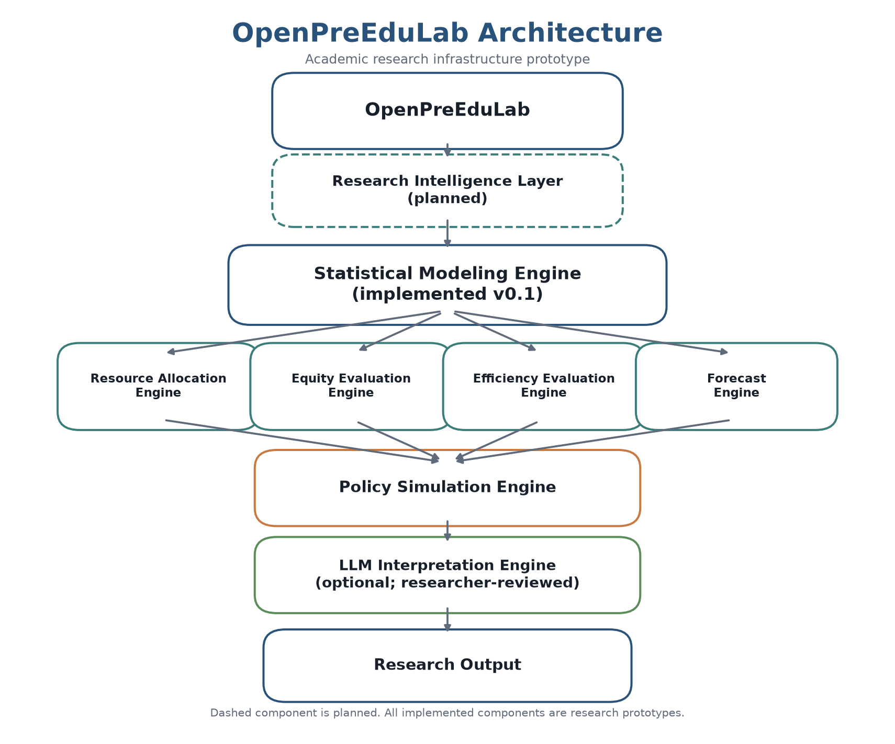
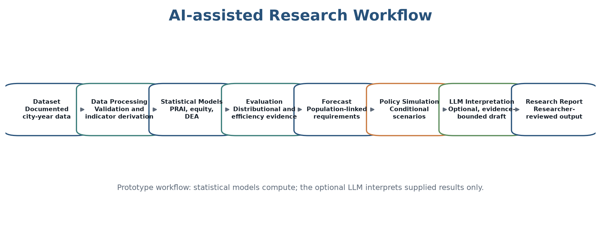
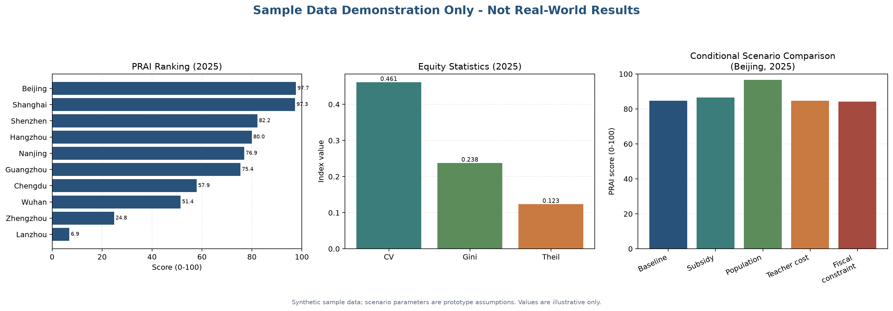
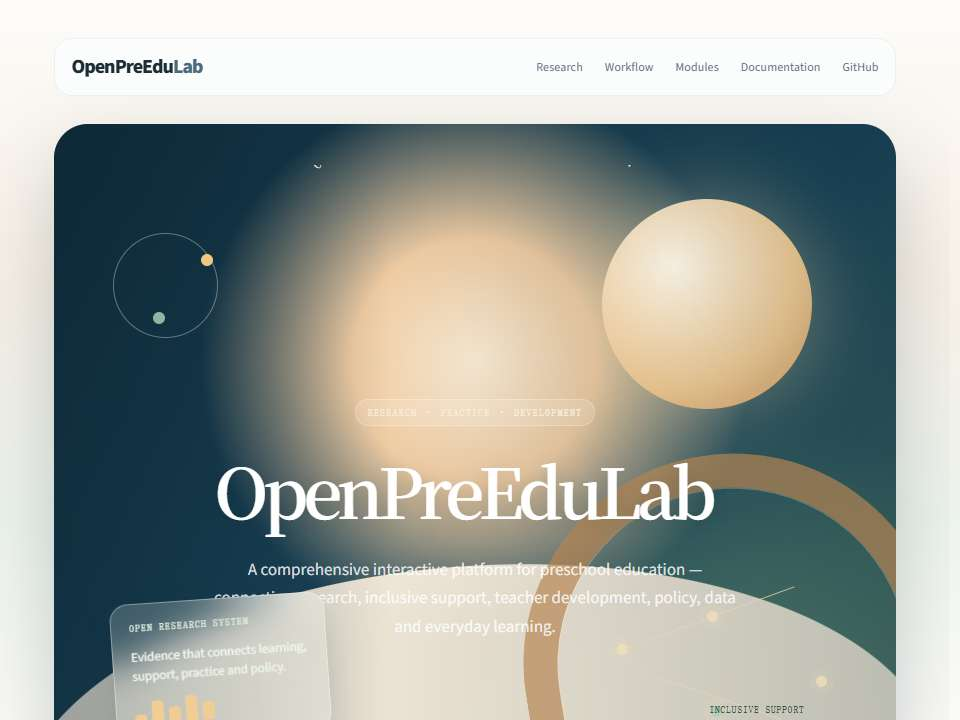
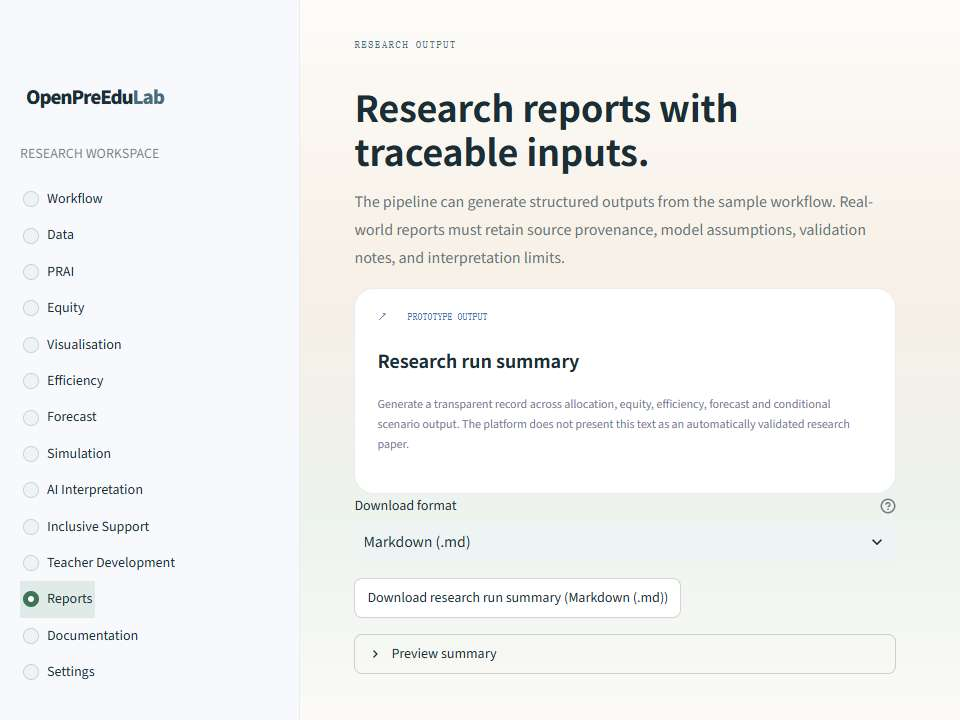

# OpenPreEduLab

[](VERSION)
[](LICENSE)

[](https://openpreedulab-85aycdefait8stbdivqxpx.streamlit.app/)

**Project Status:** Research Prototype v0.1.0

Current version focuses on framework development and prototype implementation.

> [Launch OpenPreEduLab Platform](https://openpreedulab-85aycdefait8stbdivqxpx.streamlit.app/)

## Open Preschool Education Research Platform

OpenPreEduLab is an open-source research infrastructure project for preschool education research. It connects documented data, statistical models, conditional policy scenarios, and evidence-bounded language interpretation into a reproducible workflow.

> Research should not end with publication. Each study can become reusable and evolving research infrastructure.

## Project Overview

The project supports research on preschool education resource allocation, equity, efficiency, demographic-resource demand, and fiscal sustainability. It is designed for researchers who need transparent computational tools rather than a general-purpose chatbot.

OpenPreEduLab does not replace scholarly judgement. Researchers remain responsible for research questions, theory, data governance, model selection, causal claims, and final interpretation.

## Research Motivation

Preschool education research often relies on manually assembled evidence and one-off analytical workflows. Indicators, data transformations, and model specifications can remain confined to individual papers, limiting inspection, replication, and cumulative development.

OpenPreEduLab addresses this problem by treating research outputs as reusable assets. Its first implementation focuses on evaluating preschool resource allocation and its related distributional, efficiency, forecast, and scenario-analysis questions.

## System Architecture

```text
Policy question and research design
        ↓
Documented city-year data
        ↓
Statistical Modeling Engine
  ├─ Resource Allocation (PRAI)
  ├─ Equity Evaluation
  ├─ Efficiency Evaluation (DEA)
  └─ Forecast Engine
        ↓
Policy Simulation Engine
        ↓
Optional LLM Interpretation Engine
        ↓
Researcher-reviewed outputs
```

The LLM layer is deliberately downstream of the statistical models. It receives structured outputs for interpretation and does not calculate or validate statistical results.

## Demo Preview

The following figures demonstrate the workflow of OpenPreEduLab using sample data. They are project showcase materials for a research prototype, not real-world deployment results.











See [Project Showcase](docs/Project_Showcase.md) for interpretation notes and presentation context.

## Implemented Features (v0.1)

- **Preschool Resource Allocation Index (PRAI):** multi-dimensional evaluation of financial, human, material, and demand-responsive conditions.
- **Educational Equity Engine:** coefficient of variation, Gini coefficient, and decomposable Theil T index.
- **Efficiency Evaluation Engine:** year-specific, input-oriented VRS/CCR DEA evaluation.
- **Forecast Engine:** transparent city-level linear population trend projections, with conditional teacher and fiscal requirements.
- **Policy Simulation Engine:** conditional scenarios for subsidy changes, population decline, teacher-cost increases, and fiscal constraints.
- **Visualization Engine:** ranking, trend, radar, heatmap, forecast, and scenario-comparison figures using matplotlib.
- **LLM Interpretation Engine:** provider-agnostic, prompt-reviewed, evidence-bounded research interpretation interface.
- **Inclusive Education Research Module:** five-dimension Policy → Resources → Practices → Participation → Equity analysis, descriptive Support Gap, Researcher Mode, exploratory scenarios, bounded insights, and research exports using synthetic or non-identifying institution-level inputs.
- **Research Pipeline:** an end-to-end workflow that writes reproducible result tables and a provenance-oriented summary.

The included dataset is synthetic and intended only for testing the workflow. Results generated from it must not be interpreted as evidence about real cities or policies.

## Data Governance and Review

The repository distinguishes immutable official-source archives, source-faithful
staging records, and processed analytical inputs. The current real-data pilot
is under independent review; `datasets/processed/` intentionally contains no
real-world model-ready panel.

Do not treat general education expenditure as preschool expenditure, or grouped
child-age statistics as a 3-5 or 3-6 preschool-age population measure. Some
official transfer-payment records are retained only as conditional policy-
simulation parameters.

See the [Data Directory](datasets/README.md), [Data Catalog](docs/Data_Catalog.md),
[Data Review Protocol](docs/Data_Review_Protocol.md), and
[Raw Source Review Packet](docs/Raw_Source_Review_Packet.md) for current scope,
review status, and permitted uses.

## Future Development

Planned work may include literature and policy evidence mining, benchmark-oriented PRAI normalisation, richer demographic methods, uncertainty analysis, expanded validation, data-governance tooling, and community-contributed research assets.

The v0.2 [Inclusive Support design blueprint](docs/Inclusive_Support_Design.md)
has begun. It is a non-diagnostic, non-personal-data design foundation for
evidence organisation and human-reviewed inclusive-practice reflection; it is
not an assessment, placement, or automated recommendation service. The public
interface now exposes only its static purpose, safety boundaries, and release
gates; evidence resources and other interactive functions are not enabled.

The separate [Inclusive Education Research Framework](docs/Inclusive_Education_Framework.md)
now provides a working aggregate research prototype. It does not assess or
diagnose children, determine disability status, rate teachers, or estimate
causal effects. Its Support Gap is descriptive, and its included institution
data are entirely synthetic.

The remaining items in this section are directions of development, not current
platform capabilities.

## Installation

OpenPreEduLab v0.1 requires Python 3.10 or later.

```bash
git clone <your-repository-url>
cd OpenPreEduLab
python -m pip install -r requirements.txt
```

No external LLM credential is required for the core pipeline. An LLM is called only when a researcher explicitly provides an approved client implementation.

## Quick Start

Run the complete pipeline with the synthetic dataset:

```bash
python -c "from pipeline.research_pipeline import run_research_pipeline; run_research_pipeline('datasets/sample_preschool_data.csv')"
```

The pipeline writes result tables and `research_summary.md` to `results/`. See [Getting Started](docs/Getting_Started.md) for the full workflow and interpretation guidance.

## Local Research Interface

The repository also includes a local Streamlit interface for the sample-data
workflow. It provides input-schema checks, PRAI calculation, descriptive equity
evaluation, reusable visualisations, and result download.

```bash
streamlit run app/streamlit_app.py
```

The interface is available at [OpenPreEduLab Platform](https://openpreedulab-85aycdefait8stbdivqxpx.streamlit.app/). It is a research prototype. Calculations with the sample dataset or
an uploaded CSV do not establish source provenance, variable comparability, or
policy effects. See [User Interface Guide](docs/User_Interface_Guide.md).

## Platform Deployment

GitHub hosts the project source and research documentation. The interactive
Streamlit interface is deployed at [OpenPreEduLab Platform](https://openpreedulab-85aycdefait8stbdivqxpx.streamlit.app/). See [Deployment Guide](docs/Deployment_Guide.md) for the
Streamlit Community Cloud workflow and post-deployment verification checklist.

## Example Workflow

```python
from pipeline.research_pipeline import run_research_pipeline

result = run_research_pipeline(
    "datasets/sample_preschool_data.csv",
    forecast_years=[2026, 2027],
)

print(result.allocation_result.head())
print(result.equity_result.head())
```

The default scenario parameters are prototype assumptions for workflow demonstration. Replace them with documented study-specific assumptions before substantive research use.

## Project Roadmap

1. **v0.1 — Research workflow prototype:** PRAI, equity, efficiency, forecasting, scenario simulation, visualisation, optional LLM interpretation, and pipeline integration.
2. **Method validation:** indicator validation, sensitivity analysis, benchmark development, and reproducibility tests using authorised real-world data.
3. **Research Intelligence:** documented support for literature, policy, and variable evidence handling.
4. **Open research infrastructure:** reusable model specifications, data standards, and community contributions.

## Research Philosophy

- **Open:** share research assets whenever ethically and legally possible.
- **Scientific:** connect every model to explicit educational and statistical assumptions.
- **Reproducible:** retain data definitions, transformations, parameters, and outputs.
- **Policy-oriented:** study substantive educational questions rather than optimise technical metrics in isolation.
- **Human-led:** AI supports research interpretation; it does not substitute for researchers' intellectual responsibility.

## Documentation

- [Project Charter](docs/Project_Charter.md)
- [Vision](docs/Vision.md)
- [Architecture](docs/Architecture.md)
- [PRAI Method](docs/Resource_Allocation_Index.md)
- [Data Dictionary](docs/Data_Dictionary.md)
- [Data Catalog](docs/Data_Catalog.md)
- [Pipeline Guide](docs/Pipeline_Guide.md)
- [LLM Interpretation](docs/LLM_Interpretation.md)
- [Inclusive Education Framework](docs/Inclusive_Education_Framework.md)
- [Support Gap Methodology](docs/Support_Gap_Methodology.md)
- [Inclusive Education User Guide](docs/Inclusive_Education_User_Guide.md)
- [Inclusive Education Content Validation Protocol](docs/Inclusive_Education_Content_Validation_Protocol.md)
- [Inclusive Education Cognitive Interview Protocol](docs/Inclusive_Education_Cognitive_Interview_Protocol.md)
- [Inclusive Education Versioning Protocol](docs/Inclusive_Education_Versioning_Protocol.md)
- [Inclusive Education Feasibility Protocol](docs/Inclusive_Education_Feasibility_Protocol.md)
- [Inclusive Education Reliability Protocol](docs/Inclusive_Education_Reliability_Protocol.md)
- [Inclusive Education Construct Structure Readiness Protocol](docs/Inclusive_Education_Construct_Structure_Protocol.md)
- [Inclusive Education Subgroup Comparability Readiness Protocol](docs/Inclusive_Education_Subgroup_Comparability_Protocol.md)
- [Inclusive Education External Measure Relationship Readiness Protocol](docs/Inclusive_Education_External_Measure_Protocol.md)
- [Inclusive Education Alternative Weight Sensitivity Protocol](docs/Inclusive_Education_Weight_Sensitivity_Protocol.md)
- [Inclusive Education Bootstrap Sampling Uncertainty Protocol](docs/Inclusive_Education_Bootstrap_Uncertainty_Protocol.md)
- [Inclusive Education Longitudinal Panel Readiness Protocol](docs/Inclusive_Education_Longitudinal_Readiness_Protocol.md)
- [Inclusive Education Longitudinal Attrition Protocol](docs/Inclusive_Education_Attrition_Protocol.md)
- [Inclusive Education Paired Longitudinal Bootstrap Protocol](docs/Inclusive_Education_Paired_Longitudinal_Bootstrap_Protocol.md)
- [Inclusive Education Longitudinal Timing and Fieldwork Metadata Protocol](docs/Inclusive_Education_Longitudinal_Metadata_Protocol.md)
- [Inclusive Education Accessibility Check](docs/Inclusive_Education_Accessibility_Check.md)
- [Research Journal](Research_Journal.md)
- [Contributing](CONTRIBUTING.md)

## Citation

If you use OpenPreEduLab in academic work, please cite the software record in [CITATION.cff](CITATION.cff). A citation entry can be generated automatically by GitHub from this file.

## Status

OpenPreEduLab v0.1 is an early-stage research software prototype. Its models and scenario mechanisms require contextual validation before use with substantive data or policy claims.
