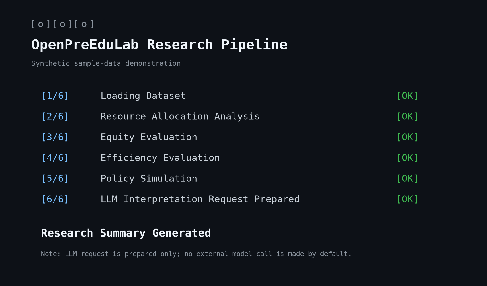

# OpenPreEduLab Project Showcase

## 1. Project Overview

OpenPreEduLab is an academic open-source research software prototype for preschool education. It connects documented city-year data with resource-allocation, equity, efficiency, forecasting, and conditional policy-simulation tools. The project is intended to make research procedures more transparent and reusable; it is not a production decision system or a substitute for researcher judgement.

The Research Intelligence Layer shown in the architecture is a planned direction, not an implemented v0.1 feature.

## 2. Research Workflow

The workflow begins with a research question and documented data, then moves through statistical evaluation, projections, conditional scenario analysis, and optional evidence-bounded interpretation. Researchers review all outputs before they become research claims.

The LLM stage is optional. It is designed to interpret supplied model outputs and does not calculate statistics, make causal inferences, or run by default.

## 3. Model Pipeline

The implemented v0.1 pipeline combines:

- the Preschool Resource Allocation Index (PRAI);
- distributional equity measures (CV, Gini, and Theil);
- input-oriented DEA efficiency evaluation;
- population-linked teacher and fiscal requirement projections;
- four conditional policy scenarios; and
- an optional, provider-agnostic LLM interpretation request.

The pipeline writes separate result tables for each module. The models retain their own assumptions and limitations; a combined workflow does not turn them into a single causal model.

## 4. Example Outputs

The figure below is generated from `datasets/sample_preschool_data.csv`, which is synthetic. It illustrates the types of visual outputs available from the project: a PRAI ranking, descriptive equity statistics, and a scenario comparison.

The values shown are not findings about the named cities, regions, or real education policies. The scenario panel shows conditional outputs under documented prototype assumptions.

The terminal-style preview records the intended pipeline sequence. It does not imply that an external LLM was contacted.

## 5. Future Development

Future work may include validation against authorised real-world datasets, benchmark-oriented normalisation, uncertainty analysis, extended demographic methods, research-intelligence tooling, and community-contributed model specifications. These directions remain subject to theoretical, empirical, ethical, and data-governance review.
